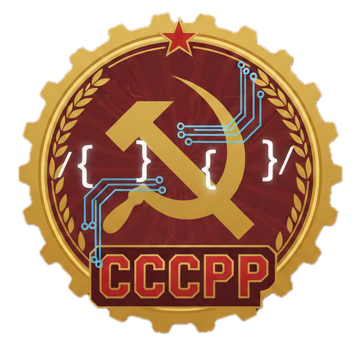

# CCCPP — Claude Code C++ UI

<p align="center">
  
</p>

A native C++ desktop application that provides a Cursor-like three-column UI for [Claude Code](https://docs.claude.com/en/docs/claude-code/cli-reference). Built with Qt6 and QScintilla, it wraps the `claude` CLI to give you a visual interface for agentic coding sessions.

## Layout

```
┌──────────────┬─────────────────────┬──────────────────────┐
│  Workspace   │    Code Viewer      │    Agent Chat(s)     │
│  Tree        │                     │   ┌────┬────┬────┐   │
│              │  - Syntax highlight │   │Tab1│Tab2│Tab3│   │
│  - Browse    │  - Diff overlay     │   ├────┴────┴────┤   │
│    files     │  - Line numbers     │   │ Chat messages │   │
│              │  - Read-only        │   │ (streaming)   │   │
│              │                     │   ├──────────────┤   │
│              │                     │   │ [Agent|Ask|Plan] │
│              │                     │   │ [input] [Send]   │
└──────────────┴─────────────────────┴──────────────────────┘
```

## Features

- **Three-column layout**: workspace file tree, syntax-highlighted code viewer, tabbed chat panels
- **Real-time streaming**: parses Claude Code's `stream-json` output for live response display
- **Agent / Ask / Plan modes**: maps directly to Claude Code CLI flags
- **Diff detection**: parses Edit/Write tool events to show green/red diff markers in the code viewer
- **Snapshot & revert**: takes git stash snapshots before each agent turn; revert button restores files
- **Chat persistence**: SQLite database at `~/.cccpp/history.db` stores sessions and messages
- **Session resume**: uses `--resume SESSION_ID` to continue conversations across restarts
- **Dark theme**: Catppuccin Mocha color palette
- **Markdown rendering**: code blocks, bold, italic, headers, lists, links, blockquotes

## Requirements

- **Claude Code CLI** (`claude`) installed and authenticated
- **Qt6** (Core, Widgets, Sql)
- **QScintilla** (optional — falls back to QPlainTextEdit without it)
- **CMake** >= 3.20
- **C++17** compiler

## Build

```bash
# macOS with Homebrew
brew install qt@6 qscintilla2

mkdir build && cd build
cmake .. -DCMAKE_PREFIX_PATH="$(brew --prefix qt);$(brew --prefix qscintilla2)"
cmake --build .

# Run
./cccpp /path/to/your/project
```

## Usage

1. **Open a workspace**: `File > Open Workspace` or pass a path as CLI argument
2. **Chat with Claude**: type in the input bar, press Enter to send
3. **Switch modes**: click Agent / Ask / Plan in the mode selector
4. **Browse files**: click files in the workspace tree to view them
5. **See diffs**: changed files show green dots in the tree; diff markers appear in the code viewer
6. **Revert changes**: click "Revert" on any agent turn to undo its file modifications
7. **Multiple sessions**: `File > New Chat` (Ctrl+N) for parallel conversations

## Configuration

Settings stored in `~/.cccpp/config.json`:

```json
{
  "claude_binary": "claude",
  "theme": "dark",
  "last_workspace": "/path/to/project"
}
```

## Architecture

The app wraps Claude Code CLI (`claude -p`) rather than calling the Anthropic API directly:

- Each user message spawns `claude -p "message" --resume SESSION_ID --output-format stream-json`
- `StreamParser` reads stdout line-by-line, parsing newline-delimited JSON events
- Text deltas stream into the chat panel; tool events feed the diff engine and snapshot manager
- `SnapshotManager` runs `git stash create` before each turn for atomic rollback

## Project Structure

```
src/
├── core/           # Process management, parsing, diff engine, DB, snapshots
├── ui/             # Qt widgets: MainWindow, WorkspaceTree, CodeViewer, ChatPanel
└── util/           # Markdown renderer, JSON helpers, config
```
