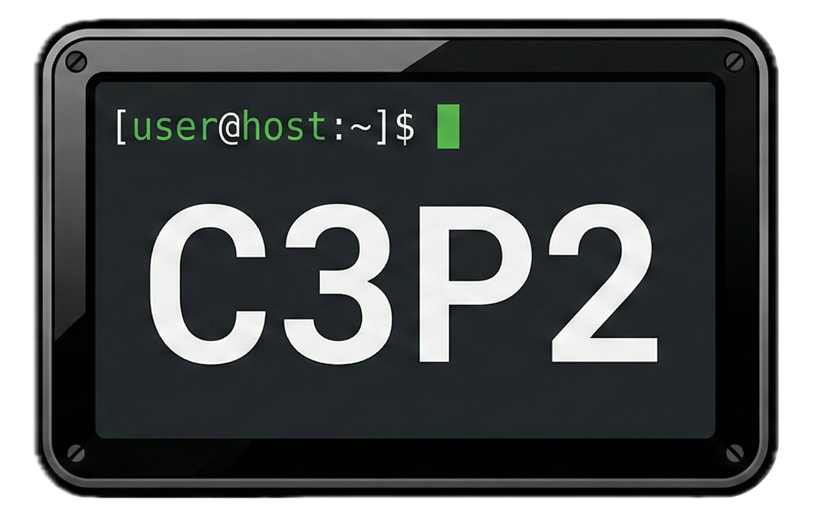
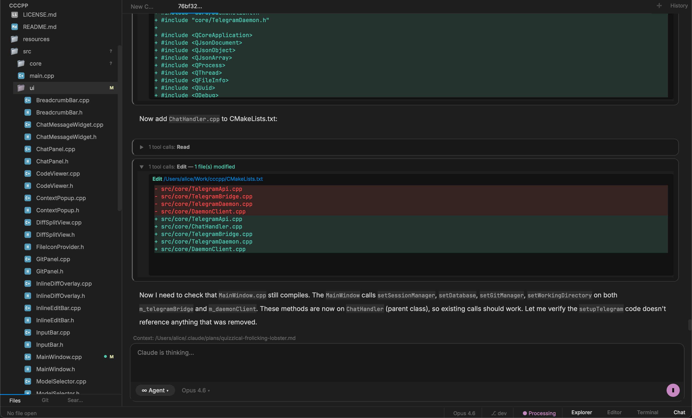
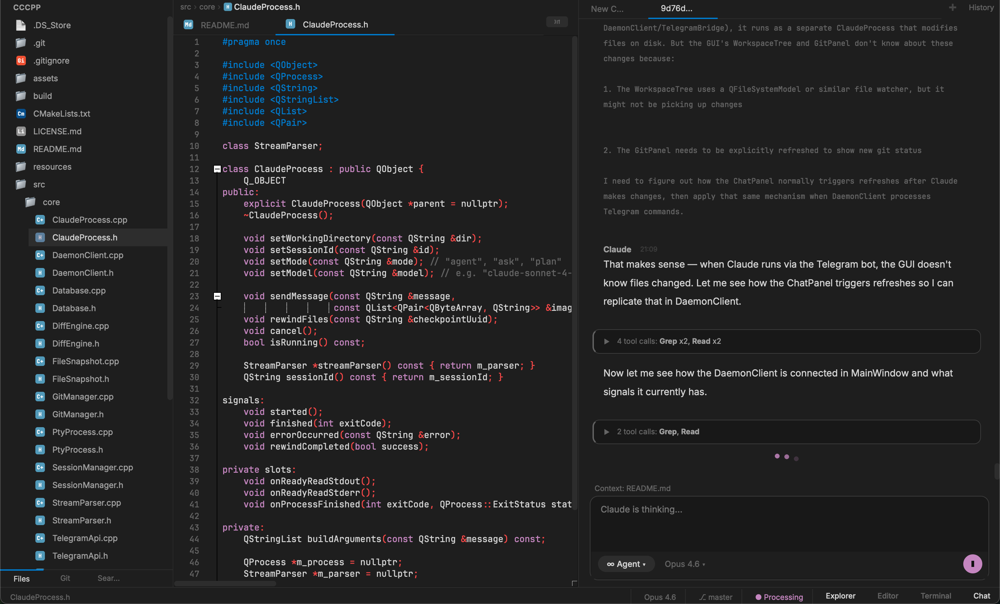

# C3P2 — Claude Code C++ UI

<p align="center">
  
</p>

A native C++ desktop application that provides a Cursor-like three-column UI for [Claude Code](https://docs.claude.com/en/docs/claude-code/cli-reference). Built with Qt6 and QScintilla, it wraps the `claude` CLI to give you a visual interface for agentic coding sessions.

## Build

Only tested on macOS (Apple Silicon).

If you do not have **CMake**:

```bash
brew install cmake
```

**Then:**

```bash
# macOS with Homebrew
brew install qt@6 qscintilla2

mkdir build && cd build
cmake .. -DCMAKE_PREFIX_PATH="$(brew --prefix qt);$(brew --prefix qscintilla2)"
cmake --build .

# Run
./c3p2 /path/to/your/project
```

Here you can see C3P2 building itself:

<p align="center">
  
</p>

<p align="center">
  
</p>

## Features

### Chat & AI

- **Real-time streaming**: parses Claude Code's `stream-json` output for live, token-by-token response display
- **Multiple chat tabs**: run parallel conversations in separate tabs, each with its own session
- **Multimodal**: accept images in the prompt
- **Agent / Ask / Plan modes**: maps directly to Claude Code CLI flags — full tool access, read-only, or permission-controlled
- **Model selection**: switch between Claude models on the fly from the toolbar
- **Chat persistence**: SQLite database at `~/.c3p2/history.db` stores sessions and messages
- **Session resume**: uses `--resume SESSION_ID` to continue conversations across restarts
- **Chat history**: browse and reopen past sessions from the history menu
- **Telegram bot**: control Claude Code remotely from any device via Telegram — send prompts, browse sessions, view diffs, commit, and more
- **Thinking indicator**: animated bouncing-dot indicator while Claude is processing
- **Markdown rendering**: code blocks, bold, italic, headers, lists, links, blockquotes, and tables
- **Tool call display**: collapsible tool-call groups per turn with inline diffs for Edit/Write operations
- **Interactive questions**: answer Claude's follow-up questions directly in the UI with radio/checkbox options
- **Revert**: use Claude revert mechanism

### Code Viewer

- **Syntax highlighting**: QScintilla-powered highlighting for 40+ languages — C/C++, Python, JavaScript/TypeScript, Rust, Go, Java, Ruby, Swift, Kotlin, HTML, CSS/SCSS, SQL, Bash, YAML, JSON, Markdown, and more
- **Multi-tab editor**: open multiple files with dirty-state tracking, close buttons, and tab reordering
- **Split diff view**: side-by-side old/new comparison with synchronized scrolling and hunk navigation
- **Diff markers**: parses Edit/Write tool events to show green/red line markers in the gutter
- **Markdown preview**: rendered HTML preview for `.md` files with theme-aware styling
- **External change detection**: watches for file modifications outside the app and prompts to reload
- **Standard editing**: undo/redo, cut/copy/paste, save single file or all files at once
- **QScintilla fallback**: gracefully falls back to QPlainTextEdit if QScintilla is not installed

### Integrated Terminal

- **Full terminal emulation**: libvterm-backed terminal with PTY support (macOS & Windows)
- **Multiple terminals**: open and manage several terminal tabs
- **Scrollback buffer**: up to 10,000 lines of history
- **Input method support**: IME integration for international input
- **Shell integration**: inherits your environment, PATH, and NVM setup

### Git Integration

- **Git panel**: stage, unstage, and discard changes on individual files or in bulk
- **Commit**: write commit messages and commit directly from the panel
- **File status**: color-coded indicators for modified, added, deleted, and untracked files
- **Branch display**: current branch shown in the status bar, auto-updates on branch changes
- **Diff viewing**: click any changed file to open a side-by-side split diff against HEAD
- **Workspace tree markers**: changed files show visual status dots in the file tree
- **Toast feedback**: success/failure notifications after commits

### Workspace & File Management

- **File tree**: hierarchical workspace browser with file/directory navigation
- **File status overlay**: git status colors and change-type markers on tree items
- **Click-to-open**: single-click loads files in the code viewer; click from chat navigates to the relevant line

### Themes

- **Four built-in themes**: Catppuccin Mocha, Macchiato, Frappé (dark), and Latte (light)
- **Runtime theme switching**: change themes from the menu without restarting
- **Unified design tokens**: consistent color palette, radii, spacing, and typography across all components

### UI & Layout

- **Three-column layout**: workspace tree + git panel | code viewer + terminal | chat panel
- **Panel toggling**: show/hide any panel from the toolbar
- **Resizable splitters**: drag to adjust column widths
- **Status bar**: displays current file, active model, git branch, and processing state
- **Toast notifications**: slide-in popups for success, error, info, and warning events
- **Animated focus ring**: input bar border animates on focus
- **Empty states**: custom illustrations when no files or chats are open

## Requirements

- **Claude Code CLI** (`claude`) >= **v2.1.0** (Jan 9, 2026) — installed and authenticated. See [Claude Code Compatibility](#claude-code-compatibility) for details.
- **Qt6** (Core, Widgets, Sql)
- **QScintilla** (optional — falls back to QPlainTextEdit without it)
- **CMake** >= 3.20
- **C++17** compiler

## Build

```bash
# macOS with Homebrew
brew install qt@6 qscintilla2

mkdir build && cd build
cmake .. -DCMAKE_PREFIX_PATH="$(brew --prefix qt);$(brew --prefix qscintilla2)"
cmake --build .

# Run
./c3p2 /path/to/your/project
```

## Configuration

Settings stored in `~/.c3p2/config.json`:

```json
{
  "claude_binary": "claude",
  "theme": "dark",
  "last_workspace": "/path/to/project"
}
```

## Telegram Bot

C3P2 includes a built-in Telegram bot that lets you interact with Claude Code from your phone or any device. It runs as a background daemon process that coordinates across multiple open workspaces.

### Setup

1. **Create a bot** — message [@BotFather](https://t.me/BotFather) on Telegram, send `/newbot`, and copy the token
2. **Get your user ID** — message [@userinfobot](https://t.me/userinfobot) to get your numeric Telegram user ID
3. **Configure C3P2** — go to `Settings > Telegram Bot` and fill in:
   - **Enable Telegram bot**: check the box
   - **Bot token**: paste the token from BotFather
   - **Allowed users**: enter your user ID (comma-separated for multiple users)
   - Click **Test Connection** to verify the token works
4. **Restart C3P2** — the daemon starts automatically on launch

Alternatively, edit `~/.c3p2/config.json` directly:

```json
{
  "telegram_enabled": true,
  "telegram_bot_token": "123456:ABC-DEF...",
  "telegram_allowed_users": [123456789]
}
```

### Bot Commands

| Command | Description |
|---------|-------------|
| Free text | Send a prompt to Claude in the active session |
| `/sessions` | List and switch between sessions (inline keyboard) |
| `/new` | Start a new session |
| `/status` | Show current session state |
| `/files` | List changed files |
| `/diff [file]` | View a file diff |
| `/commit [msg]` | Commit staged changes |
| `/branch` | Show current git branch |
| `/mode [agent/ask/plan]` | Switch Claude's mode |
| `/revert` | Revert the last turn's file changes |
| `/cancel` | Cancel the current request |
| `/help` | Show available commands |

### How It Works

The bot runs as a daemon process (`c3p2 --daemon`) that owns the Telegram API connection and routes messages to C3P2 instances via local IPC (Unix sockets / Windows named pipes). Each C3P2 instance registers its workspace with the daemon on startup. When you send a message from Telegram, the daemon forwards it to the correct instance, which runs Claude and streams the response back.

## Architecture

The app wraps Claude Code CLI (`claude -p`) rather than calling the Anthropic API directly:

- Each user message spawns `claude -p "message" --resume SESSION_ID --output-format stream-json`
- `StreamParser` reads stdout line-by-line, parsing newline-delimited JSON events
- Text deltas stream into the chat panel; tool events feed the diff engine and snapshot manager
- `SnapshotManager` runs `git stash create` before each turn for atomic rollback

## Claude Code Compatibility

C3P2 spawns the **Claude Code CLI binary** (`claude`) as a child process — it does **not** use the [Agent SDK](https://docs.anthropic.com/en/docs/claude-code/sdk/sdk-overview) libraries (Python/TypeScript). There is no version check at startup; C3P2 assumes the installed binary supports the `stream-json` protocol.

### Minimum version

**v2.1.0** (Jan 9, 2026) for full functionality. Earlier versions lack support for flags C3P2 relies on:

| Minimum version | What it unlocks |
|-----------------|-----------------|
| **v1.0.86** (Aug 21, 2025) | Basic chat — `--replay-user-messages` is passed unconditionally |
| **v2.0.0** (Sep 29, 2025) | Chat + rewind — `--rewind-files` and `CLAUDE_CODE_ENABLE_SDK_FILE_CHECKPOINTING` |
| **v2.1.0** (Jan 9, 2026) | All features including plan mode — `--permission-mode plan` |

### CLI flags used

Every chat session is started with:

```
claude -p \
  --input-format stream-json \
  --output-format stream-json \
  --verbose \
  --include-partial-messages \
  --replay-user-messages \
  --session-id <uuid>          # new session
  --resume <session-id>        # or resumed session
  --permission-mode <mode>     # bypassPermissions | plan
  --tools <list>               # or --allowedTools <list>
  --model <model>              # if set by user
```

The rewind feature runs a separate process:

```
claude --resume <session-id> --rewind-files <checkpoint-uuid>
```

### Environment variables

| Variable | Value | Purpose |
|----------|-------|---------|
| `CLAUDE_CODE_ENABLE_SDK_FILE_CHECKPOINTING` | `1` | Enables file checkpoint tracking so rewind works |
| `PATH` | Prepended with `~/.local/bin`, `/usr/local/bin`, `/opt/homebrew/bin`, and latest NVM node bin | Ensures the `claude` binary is discoverable from a GUI app |
| `HOME` | Set if empty | Required on macOS where GUI apps may not inherit it |

### Stream-JSON protocol

`StreamParser` expects newline-delimited JSON on stdout. The message types it handles:

| Type | Key fields | Purpose |
|------|-----------|---------|
| `system` | `session_id` | Session initialization |
| `result` | `session_id` | Session completion |
| `assistant` | `message.content[]`, `session_id` | Full assistant snapshots, tool-use blocks |
| `user` | `uuid`, `isReplay` | Checkpoint UUIDs for rewind (via `--replay-user-messages`) |
| `tool_result` | `content` | Tool execution results |
| `error` | `error.message` | Error reporting |
| `stream_event` | `event` | Wraps Anthropic streaming events (`content_block_delta`, `content_block_start`, `content_block_stop`) |

Input is sent as a single newline-terminated JSON envelope on stdin, then the write channel is closed:

```json
{"type":"user","message":{"role":"user","content":[{"type":"text","text":"..."}]}}
```
