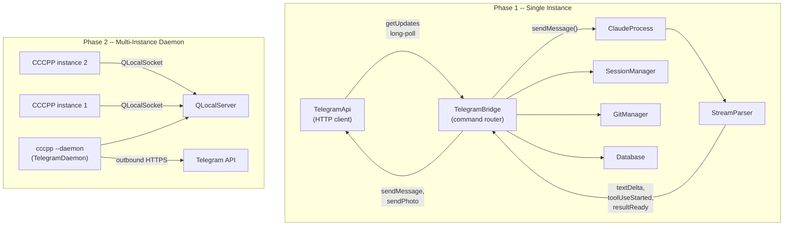

# Telegram Bot Integration for CCCPP

## Architecture Overview



## Cross-Platform Compatibility

All components use Qt abstractions that work identically on macOS, Linux, and Windows:

- `QNetworkAccessManager` -- HTTPS requests (Telegram Bot API)
- `QLocalServer` / `QLocalSocket` -- local IPC (Unix domain sockets on Unix, Named Pipes on Windows)
- `QTimer` -- polling intervals
- No platform-specific code needed

## Phase 1: Single-Instance Telegram Bot

### 1.1 New file: `src/core/TelegramApi.h/.cpp`

Low-level Telegram Bot API client. Pure HTTP, no business logic.

- Uses `QNetworkAccessManager` (requires adding `Qt6::Network` to CMake)
- Long-poll via `getUpdates` with a `QTimer`-driven retry loop
- Methods: `sendMessage()`, `sendPhoto()`, `editMessage()`, `answerCallbackQuery()`
- Signals: `messageReceived(TelegramMessage)`, `callbackQueryReceived(TelegramCallback)`
- Handles Markdown formatting, inline keyboards, and multipart image uploads
- Auth: validates incoming `chat_id` against the allowed users list from config

Key struct:

```cpp
struct TelegramMessage {
    qint64 chatId;
    qint64 messageId;
    QString text;
    QString firstName;
    qint64 userId;
};
```

### 1.2 New file: `src/core/TelegramBridge.h/.cpp`

The command router -- this is the Telegram equivalent of `ChatPanel`. It owns `ClaudeProcess` instances for Telegram sessions and wires `StreamParser` signals into text responses.

**Command set:**

| Command | Action |

|---------|--------|

| Free text | Route to active `ClaudeProcess::sendMessage()` |

| `/status` | Report current session state, turn number, what Claude is doing |

| `/new` | Create new session via `SessionManager::createSession()` |

| `/sessions` | List all sessions from `SessionManager::allSessions()` |

| `/files` | List changed files from `DiffEngine` / `GitManager::fileEntries()` |

| `/diff [file] `| Request diff via `GitManager::requestFileDiff()`, render + send as image |

| `/revert` | Trigger `ClaudeProcess::rewindFiles()` with latest checkpoint from `Database` |

| `/commit [msg] `| Run `GitManager::commit()` |

| `/branch` | Report `GitManager::currentBranch()` |

| `/mode [agent/ask/plan] `| Set mode for next `ClaudeProcess` |

| `/cancel` | Call `ClaudeProcess::cancel()` |

**Response accumulation:**

`StreamParser` emits `textDelta` token-by-token, which is too granular for Telegram (rate limits). The bridge accumulates text with a `QTimer` debounce (~1-2 seconds), then calls `TelegramApi::editMessage()` to update a single "Working..." message in place. On `resultReady`, it sends the final complete response.

Tool call events (`toolUseStarted`) are collected into a summary line like "Edit: src/auth.cpp" appended to the status message.

**Session mapping:**

Each Telegram user gets one active `ClaudeProcess` bound to the current workspace. The bridge stores:

```cpp
struct TelegramSession {
    ClaudeProcess *process = nullptr;
    QString sessionId;
    QString workspace;
    qint64 chatId;
    qint64 statusMessageId;  // for editMessage updates
    QString accumulatedText;
    QTimer *flushTimer = nullptr;
    bool processing = false;
};
```

### 1.3 Config changes: [src/util/Config.h](src/util/Config.h) / [src/util/Config.cpp](src/util/Config.cpp)

Add three new accessors to the `Config` singleton:

```cpp
bool telegramEnabled() const;       // "telegram_enabled" (default: false)
QString telegramBotToken() const;   // "telegram_bot_token"
QList<qint64> telegramAllowedUsers() const; // "telegram_allowed_users" (array)
```

Config JSON in `~/.cccpp/config.json`:

```json
{
    "telegram_enabled": true,
    "telegram_bot_token": "123456:ABC-DEF...",
    "telegram_allowed_users": [123456789]
}
```

### 1.4 CMake changes: [CMakeLists.txt](CMakeLists.txt)

- Change `find_package(Qt6 REQUIRED COMPONENTS Core Widgets Sql)` to include `Network`
- Add `TelegramApi.cpp` and `TelegramBridge.cpp` to `CORE_SOURCES`
- Add `Qt6::Network` to `target_link_libraries`

### 1.5 Wiring in MainWindow: [src/ui/MainWindow.cpp](src/ui/MainWindow.cpp)

In the `MainWindow` constructor, after existing core objects are created:

- Check `Config::instance().telegramEnabled()`
- If true, create `TelegramApi` and `TelegramBridge`
- Give the bridge access to `SessionManager`, `Database`, `DiffEngine`, `GitManager`
- Set the workspace path on workspace change
- Start polling

This mirrors exactly how `ChatPanel` is wired today (lines 36-68 of MainWindow.cpp), just substituting `TelegramBridge` for `ChatPanel`.

### 1.6 Settings UI: [src/ui/SettingsDialog.cpp](src/ui/SettingsDialog.cpp)

Add a "Telegram" tab to the existing settings dialog:

- Enable/disable toggle
- Bot token field (password-masked)
- Allowed user IDs field
- "Test Connection" button that calls `getMe` and shows the bot username

---

## Phase 2: Multi-Instance Daemon

### 2.1 New file: `src/core/TelegramDaemon.h/.cpp`

A lightweight coordinator process that owns the `TelegramApi` and routes messages to the correct CCCPP instance via `QLocalServer`.

**Startup logic (in `main.cpp`):**

```cpp
if (args.contains("--daemon")) {
    // No UI, just TelegramDaemon + event loop
    TelegramDaemon daemon;
    daemon.start();
    return app.exec();
}
```

For non-daemon instances: on startup, try `QLocalSocket::connectToServer("cccpp-telegram")`. If it connects, a daemon is already running -- register this instance's workspace. If it fails, spawn `cccpp --daemon` as a detached `QProcess`, then connect.

### 2.2 IPC protocol over `QLocalSocket`

JSON-based, newline-delimited, same pattern as `StreamParser`:

**Instance -> Daemon:**

```json
{"type": "register", "workspace": "/Users/me/project", "name": "my-api"}
{"type": "unregister", "workspace": "/Users/me/project"}
{"type": "response", "chat_id": 123, "text": "Done editing 3 files."}
{"type": "send_photo", "chat_id": 123, "image_base64": "..."}
```

**Daemon -> Instance:**

```json
{"type": "message", "chat_id": 123, "text": "fix the tests"}
{"type": "command", "chat_id": 123, "command": "status"}
{"type": "command", "chat_id": 123, "command": "diff", "args": "main.cpp"}
```

The daemon handles: workspace listing (`/ws`), workspace switching, user auth, Telegram polling. The CCCPP instance handles: Claude interaction, git ops, diff rendering -- everything that requires local state.

### 2.3 New file: `src/core/DaemonClient.h/.cpp`

Runs inside each CCCPP instance. Connects to the daemon's `QLocalServer`, sends registration, receives routed commands, sends responses back.

- On `MainWindow::openWorkspace()` -- sends `register` message
- On `MainWindow` close -- sends `unregister`
- On incoming `message` from daemon -- routes to local `ClaudeProcess`
- On `StreamParser` events -- sends accumulated responses back to daemon

### 2.4 Daemon lifecycle

- Auto-started by first CCCPP instance
- Stays alive as long as at least one instance is registered
- 30-second grace period after last instance disconnects before self-terminating
- Lock file at `~/.cccpp/telegram-daemon.lock` with PID for stale-process detection

---

## File Summary

| File | Type | Phase |

|------|------|-------|

| `src/core/TelegramApi.h/.cpp` | New | 1 |

| `src/core/TelegramBridge.h/.cpp` | New | 1 |

| `src/util/Config.h/.cpp` | Modify | 1 |

| `CMakeLists.txt` | Modify | 1 |

| `src/ui/MainWindow.cpp` | Modify | 1 |

| `src/ui/SettingsDialog.cpp` | Modify | 1 |

| `src/core/TelegramDaemon.h/.cpp` | New | 2 |

| `src/core/DaemonClient.h/.cpp` | New | 2 |

| `src/main.cpp` | Modify | 2 |